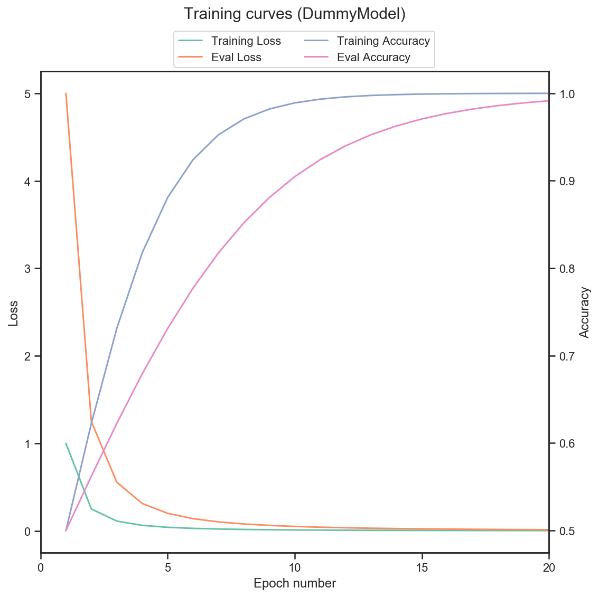

# Machine Learning Helper

## 1. Installation

WIP

## 2. Usage

Example code:

``` python
from src.training import (
    delete_model, register_model_in_db, register_epoch_in_db
)
from src.viz import plot_training_curves_for_model


# Register the model with the training parameters
register_model_in_db(
    model_id="DummyModel",
    params=dict(lr=0.001)
)

# Loop for all epochs
for i in range(20):

    # ... Your model trains ...

    # Model metrics (these are fake ones)
    train_loss = 1/((i+1)**2)
    eval_loss = 5/((i+1)**2)
    train_acc = 1 / (1 + np.exp(-i/2))
    eval_acc = 1 / (1 + np.exp(-i/4))

    # Register the epoch results
    epoch = register_epoch_in_db(
        model_id="DummyModel",
        epoch_number=i+1,
        training_loss=train_loss,
        eval_loss=eval_loss,
        training_acc=train_acc,
        eval_acc=eval_acc
    )

    # Generate a well formatted string with epoch results
    print(epoch)

# Plot the training curves
plot_training_curves_for_model("DummyModel");
```

Example output:

```text
Epoch 001: Training Loss=1.0 Eval Loss=5.0000 Training Accuracy=0.5000 Eval Accuracy=0.5000.
Epoch 002: Training Loss=0.25 Eval Loss=1.2500 Training Accuracy=0.6225 Eval Accuracy=0.5622.
Epoch 003: Training Loss=0.1111 Eval Loss=0.5556 Training Accuracy=0.7311 Eval Accuracy=0.6225.
Epoch 004: Training Loss=0.0625 Eval Loss=0.3125 Training Accuracy=0.8176 Eval Accuracy=0.6792.
Epoch 005: Training Loss=0.04 Eval Loss=0.2000 Training Accuracy=0.8808 Eval Accuracy=0.7311.
Epoch 006: Training Loss=0.02778 Eval Loss=0.1389 Training Accuracy=0.9241 Eval Accuracy=0.7773.
Epoch 007: Training Loss=0.02041 Eval Loss=0.1020 Training Accuracy=0.9526 Eval Accuracy=0.8176.
Epoch 008: Training Loss=0.01562 Eval Loss=0.0781 Training Accuracy=0.9707 Eval Accuracy=0.8520.
Epoch 009: Training Loss=0.01235 Eval Loss=0.0617 Training Accuracy=0.9820 Eval Accuracy=0.8808.
Epoch 010: Training Loss=0.01 Eval Loss=0.0500 Training Accuracy=0.9890 Eval Accuracy=0.9047.
Epoch 011: Training Loss=0.008264 Eval Loss=0.0413 Training Accuracy=0.9933 Eval Accuracy=0.9241.
Epoch 012: Training Loss=0.006944 Eval Loss=0.0347 Training Accuracy=0.9959 Eval Accuracy=0.9399.
Epoch 013: Training Loss=0.005917 Eval Loss=0.0296 Training Accuracy=0.9975 Eval Accuracy=0.9526.
Epoch 014: Training Loss=0.005102 Eval Loss=0.0255 Training Accuracy=0.9985 Eval Accuracy=0.9627.
Epoch 015: Training Loss=0.004444 Eval Loss=0.0222 Training Accuracy=0.9991 Eval Accuracy=0.9707.
Epoch 016: Training Loss=0.003906 Eval Loss=0.0195 Training Accuracy=0.9994 Eval Accuracy=0.9770.
Epoch 017: Training Loss=0.00346 Eval Loss=0.0173 Training Accuracy=0.9997 Eval Accuracy=0.9820.
Epoch 018: Training Loss=0.003086 Eval Loss=0.0154 Training Accuracy=0.9998 Eval Accuracy=0.9859.
Epoch 019: Training Loss=0.00277 Eval Loss=0.0139 Training Accuracy=0.9999 Eval Accuracy=0.9890.
Epoch 020: Training Loss=0.0025 Eval Loss=0.0125 Training Accuracy=0.9999 Eval Accuracy=0.9914.
```


